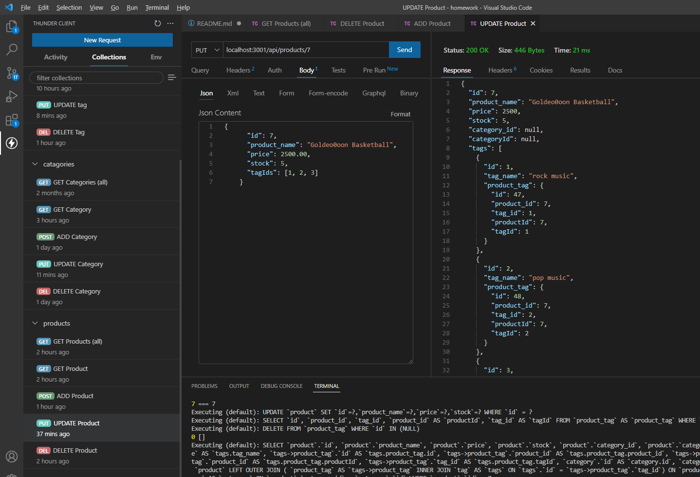
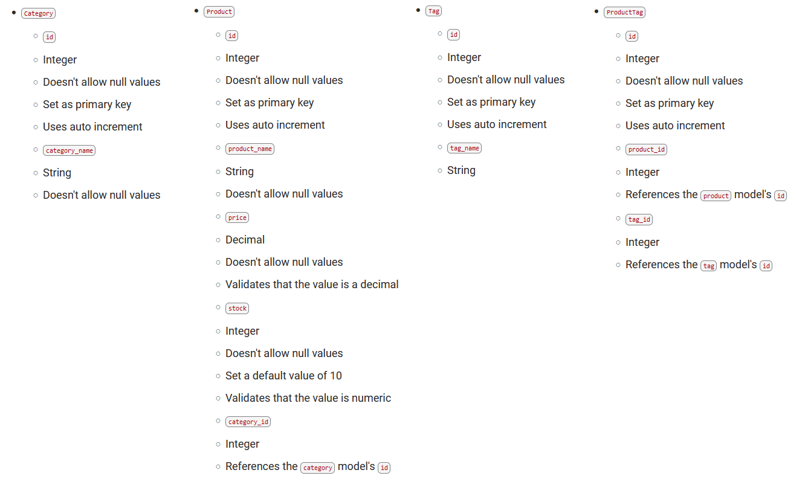

# ecommerce_be
## Table of Contents
- [Description](#description)
- [User Story](#user-story)
- [Acceptance Criteria](#acceptance-criteria)
- [Table of Contents](#table-of-contents)
- [Installation](#installation)
- [Usage](#usage)
- [Tests](#tests)
- [Questions](#questions)


## Description
  
A node.js backend application that allows the user to access and change a MYSQL database for Products, Catergories, Tags, and Product Tags. The application contains no front end but provides the models for the tables, routes to perform full CRUD operations to the database, and seeds for the user's stock.

The application includes safeguards to update the Id if the Id is not being used. Every update and create operation also returns the full .json of the row item.

This application uses ecommerce_db.

</br></br></br></br></br>[CLICK HERE -- The file showing full functionality of the application](https://youtu.be/zWZxKPw0aVg)  
  


## User Story
  
```
AS A manager at an internet retail company
I WANT a back end for my e-commerce website that uses the latest technologies
SO THAT my company can compete with other e-commerce companies
```
  

## Acceptance Criteria
  
``` 
GIVEN a functional Express.js API
WHEN I add my database name, MySQL username, and MySQL password to an environment variable file
THEN I am able to connect to a database using Sequelize
WHEN I enter schema and seed commands
THEN a development database is created and is seeded with test data
WHEN I enter the command to invoke the application
THEN my server is started and the Sequelize models are synced to the MySQL database
WHEN I open API GET routes in Insomnia Core for categories, products, or tags
THEN the data for each of these routes is displayed in a formatted JSON
WHEN I test API POST, PUT, and DELETE routes in Insomnia Core
THEN I am able to successfully create, update, and delete data in my database
```


## Installation 
Run the following commands at the project root directory.</br></br>- `npm i`</br>- Configure the .env file </br>- Run Mysql: SOURCE db/schema.sql </br>- npm run seed </br>- npm run start
  

## Usage 
This application uses dotenv, which requires mysql log-in information in the .env </br> The schema.sql uses ecommerce_db </br>
Run the following commands at the project root directory</br></br>`npm run start`


## Tests
No tests included.


## Questions
[Nathan Patnaude](mailto:Nathanpatnaude@gmail.com) , [GitHub Account](https://github.com/Nathanpatnaude)<br />
This Project is on [GitHub](https://github.com/Nathanpatnaude/ecommerce_be)

